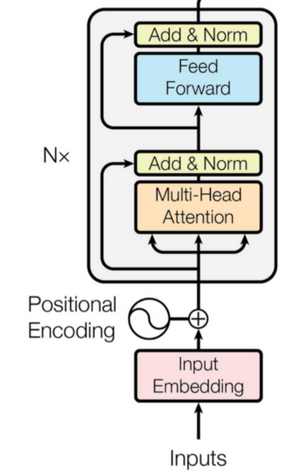

# SparseBERT For PyTorch

This repository provides a script and recipe to search the BERT model with sparse attention mask for PyTorch to balance the performance and efficiency.
Our implementation is an further version of the [NVIDIA implementation](https://github.com/NVIDIA/DeepLearningExamples/tree/master/PyTorch/LanguageModeling/BERT), which leverages mixed precision arithmetic and Tensor Cores on Volta V100 and Ampere A100 GPUs for faster training times while maintaining target accuracy.
 
 
 
## Model overview
 
BERT, or Bidirectional Encoder Representations from Transformers, is a new method of pre-training language representations which obtains state-of-the-art results on a wide array of Natural Language Processing (NLP) tasks. This model is based on the [BERT: Pre-training of Deep Bidirectional Transformers for Language Understanding](https://arxiv.org/abs/1810.04805) paper. 

### Model architecture
 
The BERT model uses the same architecture as the encoder of the Transformer. Input sequences are projected into an embedding space before being fed into the encoder structure. Additionally, positional and segment encodings are added to the embeddings to preserve positional information. The encoder structure is simply a stack of Transformer blocks, which consist of a multi-head attention layer followed by successive stages of feed-forward networks and layer normalization. The multi-head attention layer accomplishes self-attention on multiple input representations.
 
An illustration of the architecture taken from the [Transformer paper](https://arxiv.org/pdf/1706.03762.pdf) is shown below.
 
 
 
 In this work, we just focus on BERT-base with following configuration.
 
 | **Model** | **Hidden layers** | **Hidden unit size** | **Attention heads** | **Feedforward filter size** | **Max sequence length** | **Parameters** |
|:---------:|:----------:|:----:|:---:|:--------:|:---:|:----:|
|BERT-base |12 encoder| 768| 12|4 x  768|512|110M|
 
 
## Quick Start Guide
 
Our main difference is [run_pretraining.py] and [modeling.py].
For quick start guide, you can refer to NVIDIA's repository.